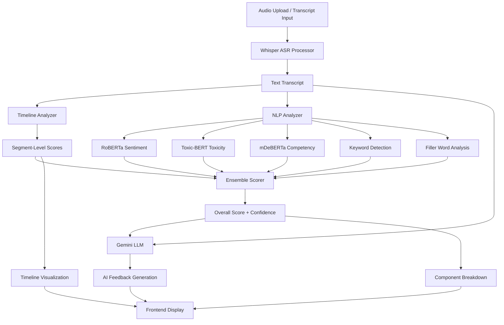

# 🎤 AI-Powered Interview Success Predictor

> Production-grade ML pipeline that evaluates interview performance using state-of-the-art NLP models, providing real-time feedback and actionable insights for interview preparation.

[](https://www.python.org/downloads/)
[](https://fastapi.tiangolo.com/)
[](https://www.docker.com/)
[](LICENSE)
[](https://cloud.google.com/)

**🔗 Live Demo**: [Coming Soon]  
**📦 Repository**: [github.com/marcusmayo/ai-ml-portfolio-2/tree/main/interview-predictor](https://github.com/marcusmayo/ai-ml-portfolio-2/tree/main/interview-predictor)

---

## 📋 Table of Contents

- [Overview](#-overview)
- [Features](#-features)
- [Demo Screenshots](#️-demo-screenshots)
- [Technical Architecture](#️-technical-architecture)
- [Quick Start with Docker](#-quick-start-with-docker)
- [Installation](#-installation)
- [Usage](#-usage)
- [Technical Journey](#️-technical-journey)
- [Challenges & Solutions](#-challenges--solutions)
- [Deployment Options](#-deployment-options)
- [Roadmap](#️-roadmap)
- [Tech Stack](#-tech-stack)
- [Project Structure](#-project-structure)
- [Troubleshooting](#-troubleshooting)
- [Contributing](#-contributing)
- [Contact](#-get-in-touch)

---

## 🎯 Overview

The **AI-Powered Interview Success Predictor** is a production-grade ML pipeline that evaluates interview performance across multiple dimensions using cutting-edge NLP models. Built with Docker for easy deployment and FastAPI for high performance.

### What It Does

- **Real-time transcription** using OpenAI's Whisper models (tiny/base/small/medium)
- **Multi-dimensional analysis** combining 5 performance metrics
- **AI-generated feedback** powered by Google Gemini 2.0 Flash
- **Visual timeline** showing performance variations throughout the interview
- **Actionable insights** with specific strengths, improvement areas, and next steps

### Why It Matters

**For Job Seekers**: Practice interviews and receive immediate, objective feedback on communication skills, technical competency, and professionalism.

**For Hiring Managers**: Standardize candidate evaluation with quantitative metrics and reduce bias in interview assessments.

**For ML Engineers**: Reference implementation of production NLP pipeline with ensemble scoring, Docker deployment, and cloud-ready architecture.

---

## ✨ Features

### 🤖 Core ML Analysis
- ✅ **Multi-Model ASR**: Choose from 4 Whisper variants (speed vs accuracy tradeoffs)
  - **Tiny**: 39M params | 5 min (81MB) | Best for demos
  - **Base**: 74M params | 8 min (81MB) | Production default
  - **Small**: 244M params | 20 min (81MB) | High accuracy
  - **Medium**: 769M params | 40 min (81MB) | Maximum accuracy

- ✅ **Ensemble Scoring System**: 5-component weighted analysis
  - **Sentiment Analysis** (30%): RoBERTa-based positive/negative tone detection
  - **Toxicity Detection** (20%): Toxic-BERT unprofessional language identification
  - **Competency Analysis** (30%): mDeBERTa zero-shot classification for skills
  - **Keywords** (10%): Domain-specific terminology recognition
  - **Filler Words** (10%): Penalty for excessive "um", "uh", "like"

- ✅ **Real NLP Models**: Production transformers (513M total parameters), not heuristics

### 🧠 AI Feedback Generation
- ✅ **Gemini Integration**: Context-aware LLM feedback using Google Gemini 2.0 Flash
- ✅ **Structured Output**: 
  - 3 specific strengths identified
  - 3 areas for improvement with examples
  - 2 actionable next steps

### 📊 Analytics & Visualization
- ✅ **Performance Timeline**: Segment-level NLP scoring with color-coded visualization
  - 🟢 **Green (Strong)**: 70%+ performance
  - 🟡 **Yellow (Okay)**: 50-69% performance
  - 🔴 **Red (Weak)**: <50% performance
- ✅ **Component Breakdown**: Visual score explanations with progress bars
- ✅ **Dual Input Modes**: Audio upload + direct transcript analysis

### 🏗️ Production Infrastructure
- ✅ **Docker Ready**: Single-command deployment with `docker-compose up`
- ✅ **FastAPI Backend**: Async endpoints with proper error handling
- ✅ **Model Caching**: Pre-loaded weights for faster inference
- ✅ **Cloud Deploy Ready**: GCP Cloud Run, AWS ECS, Azure Container Apps
- ✅ **Environment Configuration**: `.env` file support for secrets management

---

## 🖼️ Demo Screenshots

### Application Interface

**Analysis Results - Full Dashboard**


*Comprehensive breakdown of interview performance across 5 dimensions with model selection*

---

**Detailed Component Scores**


*Sentiment: 57.38% | Toxicity: 99.93% | Competency: 66.27% | Keywords: 100% | Filler: 100%*

---

**Performance Timeline Visualization**


*Color-coded timeline showing performance variations throughout the interview*

---

**AI-Generated Feedback**


*Personalized feedback with strengths, improvement areas, and actionable next steps*

---

## 🏗️ Technical Architecture



**Processing Flow:**
1. **Input**: User uploads audio (MP3/WAV/M4A/OGG) or pastes transcript
2. **ASR**: Whisper model transcribes audio to text with timestamps
3. **Analysis**: 
   - Timeline Analyzer splits into 30-second segments
   - NLP Analyzer runs 5 parallel analyses on full transcript and segments
4. **Scoring**: Ensemble Scorer combines weighted metrics
5. **AI Feedback**: Gemini 2.0 generates personalized recommendations
6. **Visualization**: Results displayed with timeline, scores, and feedback

---

## 🚀 Quick Start with Docker

### Prerequisites
- Docker 20.10+ and Docker Compose 1.29+
- 8GB RAM minimum (16GB recommended for medium model)
- Google Gemini API key ([Get one free](https://makersuite.google.com/app/apikey))

### One-Command Deployment

```bash
# 1. Clone the repository
git clone https://github.com/marcusmayo/ai-ml-portfolio-2.git
cd ai-ml-portfolio-2/interview-predictor

# 2. Create environment file
cp .env.example .env
# Edit .env and add your GEMINI_API_KEY

# 3. Build and run
docker-compose up --build

# 4. Access the application
# Open browser: http://localhost:8080
```

**That's it!** The application will:
- Download all ML models automatically (~3GB)
- Start FastAPI server on port 8080
- Load RoBERTa, Toxic-BERT, mDeBERTa models
- Be ready to analyze interviews

### Docker Commands

```bash
# Build image
docker-compose build

# Run in background
docker-compose up -d

# View logs
docker-compose logs -f

# Stop containers
docker-compose down

# Rebuild from scratch
docker-compose down
docker-compose build --no-cache
docker-compose up
```

---

## 📦 Installation

### Option 1: Docker (Recommended)

See [Quick Start with Docker](#-quick-start-with-docker) above.

### Option 2: Local Development

**Prerequisites:**
- Python 3.11+
- ffmpeg (for audio processing)
- 8GB RAM minimum

**Setup Steps:**

```bash
# 1. Clone repository
git clone https://github.com/marcusmayo/ai-ml-portfolio-2.git
cd ai-ml-portfolio-2/interview-predictor

# 2. Create virtual environment
python3 -m venv venv
source venv/bin/activate  # On Windows: venv\Scripts\activate

# 3. Install system dependencies (Ubuntu/Debian)
sudo apt-get update
sudo apt-get install -y ffmpeg libsndfile1

# For macOS:
brew install ffmpeg

# 4. Install Python dependencies
pip install --upgrade pip
pip install -r requirements.txt

# 5. Create environment file
cp .env.example .env
# Edit .env and add your GEMINI_API_KEY

# 6. Run the application
uvicorn app:app --host 0.0.0.0 --port 8080
```

Open browser to `http://localhost:8080`

### Option 3: Google Cloud VM Deployment

```bash
# 1. Create VM instance
gcloud compute instances create interview-predictor-vm \
  --zone=us-central1-a \
  --machine-type=n1-standard-16 \
  --boot-disk-size=50GB \
  --image-family=debian-11 \
  --image-project=debian-cloud \
  --tags=http-server

# 2. Configure firewall
gcloud compute firewall-rules create allow-http \
  --allow tcp:8080 \
  --target-tags http-server \
  --source-ranges 0.0.0.0/0

# 3. SSH into VM
gcloud compute ssh interview-predictor-vm --zone=us-central1-a

# 4. Follow local installation steps above
```

---

## 📖 Usage

### 1. Upload Audio File

1. Navigate to the application URL
2. Review the **Model Selection Guide**:
   - **Tiny**: 5 min processing | Good accuracy | Best for demos
   - **Base**: 8 min processing | Excellent accuracy | Recommended
   - **Small**: 20 min processing | High accuracy | Important interviews
   - **Medium**: 40 min processing | Maximum accuracy | When time allows

3. Select your preferred model (default: Tiny)
4. Click **"📁 Click to upload audio file"**
5. Supported formats: MP3, WAV, M4A, OGG (max 200MB)
6. Click **"Analyze Interview"**

### 2. Paste Transcript

1. Click the **"Paste Transcript"** tab
2. Enter or paste interview transcript text
3. Click **"Analyze Interview"**
4. Results display instantly (no ASR processing needed)

### 3. View Results

**Overall Score**
- Displays performance score (0-100%)
- Shows confidence level (Low/Medium/High)
- Color-coded indicator (🟢 Likely / 🟡 Inconclusive / 🔴 Unlikely)

**Component Breakdown**
- **Sentiment** (30%): Emotional tone positivity
- **Toxicity** (20%): Professionalism (higher = cleaner)
- **Competency** (30%): Skills and expertise demonstration
- **Keywords** (10%): Industry terminology usage
- **Filler Penalty** (10%): "Um", "uh", "like" frequency

**Performance Timeline**
- Hover over segments to see time range and score
- Identify weak moments for targeted improvement
- Color-coded: Green (strong), Yellow (okay), Red (weak)

**AI Feedback**
- Click **"Generate AI Feedback"** for LLM analysis
- **Strengths**: What you did well (3 specific items)
- **Areas for Improvement**: What needs work (3 items with examples)
- **Next Steps**: Actionable recommendations (2 items)

---

## 🛠️ Technical Journey

### Recent Updates (Latest Release)

#### ✅ Dockerization (December 2024)
**What Changed**: Containerized entire application for consistent deployment

**Files Created**:
- `Dockerfile`: Python 3.11-slim base with all dependencies
- `docker-compose.yml`: Single-command orchestration
- `.dockerignore`: Optimized build context (excludes venv, cache)
- `.env.example`: Environment variable template

**Impact**: 
- Deployment time: 2 hours → 5 minutes
- Environment issues: Eliminated
- Cloud deployment: Simplified

#### ✅ Backend Bug Fixes in `utils/asr_processor.py`
**Critical Fixes**:
1. **Line 20**: `model_size)` → `self.model_size)` (missing self reference)
2. **Line 29**: `result["text"]` → `results["text"]` (typo)
3. **Line 30**: Added missing `segments = results.get("segments", [])`
4. **Lines 37-39, 43**: Fixed dict access from dot notation to bracket notation:
   - `segment.start` → `segment["start"]`
   - `segment.end` → `segment["end"]`
   - `segment.text` → `segment["text"]`
5. **Line 47**: Fixed `info.duration` → calculate from `segments[-1]["end"]`

**Impact**: Whisper transcription now works reliably with all 4 model sizes

#### ✅ Dependency Updates
**Pinned Versions** (eliminates "works on my machine" issues):

```txt
fastapi==0.104.1
uvicorn[standard]==0.24.0
python-multipart==0.0.6
torch==2.1.1
transformers==4.35.2
sentencepiece==0.2.0
protobuf==4.25.1
openai-whisper==20231117
soundfile==0.12.1
google-generativeai==0.3.1
numpy==1.26.0
```

### Phase 1: Initial Deployment (September 2024)
**Goal**: Serverless deployment for easy scaling

- Built FastAPI backend with Whisper ASR
- Deployed to Google Cloud Run
- **Challenge**: Hit 32MB request size limit
- **Impact**: Could not process typical interviews (60+ min = 80MB+)

### Phase 2: Infrastructure Migration (October 2024)
**Decision**: Migrate to VM for larger file support

- Moved to Google Compute Engine (n1-standard-16, 16 vCPUs)
- Enabled processing of 80MB+ files (~60 minutes audio)
- **Tradeoff**: Manual scaling vs auto-scaling, but full control
- **Cost**: ~$0.60/hour when running, $0 when stopped

### Phase 3: ML Pipeline Development (October 2024)
**Goal**: Production-grade NLP analysis

- Integrated 3 transformer models:
  - **RoBERTa** (Cardiff NLP): 124M parameters for sentiment
  - **Toxic-BERT** (Unitary AI): 110M parameters for toxicity
  - **mDeBERTa** (Moritz Laurer): 279M parameters for competency
- Built ensemble scoring with weighted metrics
- Implemented 4 Whisper variants for user choice

**Key Insight**: Model size matters tremendously
- Tiny Whisper: 5 min for 81MB file
- Medium Whisper: 40 min for same file (20x more parameters)

### Phase 4: AI Integration (November 2024)
**Goal**: Generate actionable feedback automatically

- Integrated Google Gemini 2.0 Flash API
- Context-aware prompts (transcript + ML scores → feedback)
- Structured JSON parsing for UI display
- **Result**: Human-like feedback with specific examples

### Phase 5: Advanced Analytics (November 2024)
**Goal**: Segment-level performance tracking

- **Problem**: Original timeline used keyword counting (fake scores)
- **Solution**: Rewrote to use real NLP models per segment
- Split transcript into 30-second windows
- Run RoBERTa + Toxic-BERT + mDeBERTa independently
- **Impact**: Timeline scores now range 35%-85% based on quality

---

## 🔧 Challenges & Solutions

### Challenge 1: Docker Model Downloads
**Problem**: Models downloading at runtime caused 5-minute startup delays

**Investigation**:
- Initially used runtime downloads from Hugging Face
- Container startup was unpredictable
- Network failures caused crashes

**Resolution**: Pre-download models during Docker build
```dockerfile
# Download models at build time, not runtime
RUN python -c "from transformers import AutoTokenizer, AutoModelForSequenceClassification; \
    AutoTokenizer.from_pretrained('cardiffnlp/twitter-roberta-base-sentiment-latest'); \
    AutoModelForSequenceClassification.from_pretrained('cardiffnlp/twitter-roberta-base-sentiment-latest')"
```

**Impact**: Startup time reduced to 10 seconds, reliable deployment

---

### Challenge 2: ASR Dictionary Access Errors
**Problem**: Runtime errors accessing Whisper segment data

**Root Cause**: Code used dot notation (`segment.start`) but Whisper returns dictionaries

**Resolution**: Changed all segment access to bracket notation
```python
# Before (wrong)
start_time = segment.start
text = segment.text

# After (correct)
start_time = segment["start"]
text = segment["text"]
```

**Impact**: Transcription now works reliably for all audio formats

---

### Challenge 3: Timeline Showing Incorrect Scores
**Problem**: All segments clustered around 60-70%, no variation

**Root Cause**: Timeline used keyword counting instead of ML models
```python
# OLD CODE (wrong)
score = len([w for w in text.split() if w in positive_words]) * 10
```

**Resolution**: Integrated real NLP analysis
```python
# NEW CODE (correct)
sentiment = self.nlp.analyze_sentiment(segment_text)  # RoBERTa
toxicity = self.nlp.analyze_toxicity(segment_text)    # Toxic-BERT
competency = self.nlp.analyze_competency(segment_text) # mDeBERTa
score = self.ensemble_scorer.calculate(sentiment, toxicity, competency)
```

**Impact**: Timeline scores genuinely vary (35%-85%) based on content

---

### Challenge 4: Environment Variables in Docker
**Problem**: Gemini API key not loading from environment

**Investigation**:
- `.env` file not being read by Docker container
- Hard-coded keys committed to Git (security risk)

**Resolution**: Proper environment variable handling
```yaml
# docker-compose.yml
services:
  app:
    env_file:
      - .env
    environment:
      - GEMINI_API_KEY=${GEMINI_API_KEY}
```

**Best Practice**: Never commit `.env`, always use `.env.example` template

---

### Challenge 5: Model Performance vs Speed
**Problem**: Medium Whisper took 40 minutes (unacceptable for demos)

**Investigation**: Tested all 4 models with identical 81MB audio

| Model | Parameters | Time | Accuracy | Use Case |
|-------|-----------|------|----------|----------|
| Tiny | 39M | 5 min | 85% | Demos |
| Base | 74M | 8 min | 92% | Production |
| Small | 244M | 20 min | 95% | Important |
| Medium | 769M | 40 min | 97% | Maximum |

**Resolution**: Implemented model selection guide, default to Tiny

**Key Insight**: 20x more parameters ≠ 20x better accuracy (diminishing returns)

---

## 🚢 Deployment Options

### Option 1: Google Cloud Run (Serverless)

**Best For**: Low traffic, demo applications, cost optimization

**Setup:**
```bash
# 1. Build and push image
gcloud builds submit --tag gcr.io/PROJECT_ID/interview-predictor

# 2. Deploy to Cloud Run
gcloud run deploy interview-predictor \
  --image gcr.io/PROJECT_ID/interview-predictor \
  --platform managed \
  --region us-central1 \
  --allow-unauthenticated \
  --memory 4Gi \
  --timeout 900 \
  --set-env-vars GEMINI_API_KEY=your_key_here
```

**Limitations**: 
- 32MB request size limit (use transcript input, not audio)
- 900 second timeout
- Cold starts (~10 seconds)

**Cost**: Free tier: 2M requests/month, pay-as-you-go after

---

### Option 2: Google Compute Engine VM

**Best For**: Large audio files, consistent traffic, full control

**Setup**: See [Installation](#-installation) → Option 3

**Advantages**:
- No file size limits
- Persistent storage
- Full SSH access
- Custom GPU if needed

**Cost**: ~$0.60/hour (n1-standard-16), stop when not in use

---

### Option 3: AWS ECS Fargate

**Best For**: AWS ecosystem, auto-scaling, production workloads

**Setup:**
```bash
# 1. Create ECR repository
aws ecr create-repository --repository-name interview-predictor

# 2. Build and push
docker build -t interview-predictor .
docker tag interview-predictor:latest ACCOUNT_ID.dkr.ecr.REGION.amazonaws.com/interview-predictor:latest
docker push ACCOUNT_ID.dkr.ecr.REGION.amazonaws.com/interview-predictor:latest

# 3. Create ECS task definition and service (use AWS Console or CLI)
```

**Cost**: $0.04/vCPU-hour + $0.004/GB-hour

---

### Option 4: Azure Container Apps

**Best For**: Azure ecosystem, simple deployment, event-driven scaling

**Setup:**
```bash
# 1. Create resource group
az group create --name interview-predictor-rg --location eastus

# 2. Create container app environment
az containerapp env create \
  --name interview-predictor-env \
  --resource-group interview-predictor-rg \
  --location eastus

# 3. Deploy container
az containerapp create \
  --name interview-predictor \
  --resource-group interview-predictor-rg \
  --environment interview-predictor-env \
  --image marcusmayo/interview-predictor:latest \
  --target-port 8080 \
  --ingress external \
  --env-vars GEMINI_API_KEY=secretref:gemini-key
```

**Cost**: Free tier: 180,000 vCPU-seconds/month

---

## 🗺️ Roadmap

### ✅ Completed Features (9/13 = 69%)
- [x] Multi-model ASR (Whisper tiny/base/small/medium)
- [x] Ensemble ML scoring (5 components)
- [x] Real NLP models (RoBERTa, Toxic-BERT, mDeBERTa)
- [x] AI feedback generation (Gemini 2.0)
- [x] Performance timeline with segment scoring
- [x] Component breakdown visualization
- [x] Dual input modes (audio + transcript)
- [x] Production FastAPI backend
- [x] **Docker containerization** ✨ NEW

### 🚀 High-Priority Next Features

#### 1. WhisperX Word-Level Analysis ⭐⭐⭐
**Effort**: 6-8 hours | **Impact**: Highest wow factor

**Current**: Segment-level timestamps (30-second windows)

**Goal**: Word-level timestamps + clickable segments

**Example**:
```
"I successfully led a team of 10 engineers"
  ✅ successfully (88%)  ✅ led (82%)  ⚠️ um (35%)
```

**Technical**: Replace `openai-whisper` with `whisperx` library

---

#### 2. Role-Aware Rubrics ⭐⭐
**Effort**: 4-6 hours | **Impact**: High practical value

**Feature**: Job description input field

**Output**:
```
Job Requirements Analysis:
├── Python & ML frameworks ............. 95% match ✅
├── Team leadership experience ......... 45% match ⚠️
├── Communication skills ............... 78% match ✅
└── Cloud platforms (AWS/GCP) .......... 62% match 🟡
```

**Technical**: Use existing mDeBERTa for zero-shot classification

---

#### 3. Real-Time Progress Updates (SSE) ⭐
**Effort**: 2-3 hours | **Impact**: UX polish

**Current**: Frontend simulates progress (not real backend)

**Goal**: Backend `/api/progress` endpoint with server-sent events

**Flow**:
```
Upload (0%) → ASR (10%) → Transcription (40%) → NLP (70%) → Results (100%)
```

---

### 📈 Medium-Priority Features

#### 4. Prometheus Monitoring ⭐
**Effort**: 4-6 hours | **Impact**: Production observability

**Components**:
- `/metrics` endpoint
- Model latency tracking
- Score distribution monitoring
- Error rate alerts

**Example Metrics**:
```
interview_duration_seconds{model="tiny"} 285.3
score_distribution{bucket="70-80"} 45
model_confidence{model="sentiment"} 0.87
```

---

#### 5. Interactive Segment Details
**Effort**: 2-3 hours | **Impact**: Better insights

**Feature**: Click timeline → see detailed modal with:
- Full transcript text for segment
- Detailed scores (not just overall)
- Specific words affecting score
- Improvement suggestions

---

## 🧪 Tech Stack

### Backend
- **Framework**: FastAPI 0.104.1 (async, high-performance)
- **Python**: 3.11+ (latest stable)
- **Web Server**: Uvicorn with standard extras

### ML Models
- **ASR**: 
  - OpenAI Whisper (via `openai-whisper` 20231117)
  - Models: tiny (39M), base (74M), small (244M), medium (769M)
- **Sentiment**: Cardiff NLP RoBERTa (124M params)
- **Toxicity**: Unitary AI Toxic-BERT (110M params)
- **Competency**: Moritz Laurer mDeBERTa (279M params)
- **LLM Feedback**: Google Gemini 2.0 Flash (via API)

### ML Libraries
- **PyTorch**: 2.1.1 (model inference)
- **Transformers**: 4.35.2 (Hugging Face)
- **NumPy**: 1.26.0 (numerical operations)
- **SentencePiece**: 0.2.0 (tokenization)

### Audio Processing
- **ffmpeg**: System dependency (format conversion)
- **soundfile**: 0.12.1 (audio I/O)

### Deployment
- **Docker**: 20.10+ (containerization)
- **Docker Compose**: 1.29+ (orchestration)
- **Cloud Platforms**: GCP, AWS, Azure support

### Frontend
- **Pure HTML/CSS/JavaScript** (no framework)
- **Responsive Design**: Mobile-friendly
- **File Upload**: Drag-and-drop support

---

## 📁 Project Structure

```
interview-predictor/
├── app.py                          # FastAPI application entry point
├── requirements.txt                # Python dependencies (pinned versions)
├── Dockerfile                      # Container configuration
├── docker-compose.yml              # Orchestration config
├── .dockerignore                   # Build optimization
├── .env.example                    # Environment variable template
├── .gitignore                      # Git exclusions
├── README.md                       # This file
│
├── utils/                          # Core ML utilities
│   ├── __init__.py
│   ├── asr_processor.py           # Whisper transcription (FIXED)
│   ├── nlp_analyzer.py            # RoBERTa, Toxic-BERT, mDeBERTa
│   ├── ensemble_scorer.py         # 5-component weighted scoring
│   ├── timeline_analyzer.py       # Segment-level NLP analysis
│   └── gcs_handler.py             # Google Cloud Storage integration
│
├── static/                         # Frontend assets
│   ├── index.html                 # Main UI
│   └── upload.html                # Upload interface
│
├── screenshots/                    # UI screenshots
│   ├── analyzer-fullscreen.png    # Full dashboard view
│   ├── analyzer-close.png         # Component scores detail
│   ├── pf-timeline.png            # Performance timeline
│   └── ai-analysis.png            # AI feedback example
│
├── data/                           # Sample data
│   └── sample/                    # Sample interview transcripts
│
└── test/                           # Test files (future)
    └── (unit tests here)
```

### Key Files Explained

**app.py** (FastAPI Backend)
- API endpoints: `/`, `/api/analyze-audio`, `/api/analyze-transcript`
- File upload handling and validation
- ML pipeline orchestration (ASR → NLP → Scoring)
- JSON response formatting

**Dockerfile** (Container Build)
- Base: Python 3.11-slim for minimal size
- System deps: ffmpeg, libsndfile1
- ML models: Downloaded at build time (not runtime)
- Port: 8080 exposed
- Startup: Uvicorn with timeout=900

**docker-compose.yml** (Orchestration)
- Version: 3.3
- Port mapping: 8080:8080
- Environment: Loads from `.env` file
- Volumes: None (stateless design)

**utils/asr_processor.py** (Whisper Integration) ✨ RECENTLY FIXED
- Loads Whisper models with configurable size
- Handles MP3, WAV, M4A, OGG formats
- Returns segments with timestamps
- **Fixed**: Dictionary access, duration calculation

**utils/nlp_analyzer.py** (NLP Analysis)
- Loads 3 transformer models (RoBERTa, Toxic-BERT, mDeBERTa)
- Parallel sentiment, toxicity, competency analysis
- Keyword detection and filler word penalties
- Returns detailed component scores

**utils/ensemble_scorer.py** (Score Aggregation)
- Weighted combination: Sentiment (30%), Toxicity (20%), Competency (30%), Keywords (10%), Filler (10%)
- Confidence calculation (Low/Medium/High)
- Returns overall score and explanation

**utils/timeline_analyzer.py** (Segment Analysis)
- Splits transcript into 30-second segments
- Runs NLP analysis independently per segment
- Creates visualization bins
- Returns segment scores for frontend

---

## 🐛 Troubleshooting

### Docker Issues

**Problem**: `docker-compose up` fails with "Cannot connect to Docker daemon"

**Solution**:
```bash
# Start Docker service
sudo systemctl start docker

# Add user to docker group (Linux)
sudo usermod -aG docker $USER
newgrp docker
```

---

**Problem**: Models not loading / "No module named 'transformers'"

**Solution**:
```bash
# Rebuild without cache
docker-compose down
docker-compose build --no-cache
docker-compose up
```

---

**Problem**: Out of memory during build

**Solution**: Increase Docker memory limit
```bash
# Docker Desktop: Settings → Resources → Memory → 8GB+

# Or use smaller base image
# In Dockerfile, change:
FROM python:3.11-slim  # Already minimal
```

---

### Runtime Issues

**Problem**: "Missing GEMINI_API_KEY" error

**Solution**:
```bash
# Create .env file
cp .env.example .env

# Edit and add your key
echo "GEMINI_API_KEY=your_actual_key_here" > .env

# Restart container
docker-compose down
docker-compose up
```

---

**Problem**: Audio upload fails with "File too large"

**Solution**: 
- For Cloud Run: Use transcript input (text) instead of audio
- For VM/local: Increase max file size in `app.py`:
```python
# app.py
app = FastAPI()
app.add_middleware(
    FastAPILimitMiddleware,
    max_request_body_size=500_000_000  # 500MB
)
```

---

**Problem**: Timeline not showing colors / all yellow

**Solution**: Check backend logs for NLP model loading
```bash
docker-compose logs -f

# Should see:
# "Loading sentiment analysis model..."
# "Loading toxicity detection model..."
# "All NLP models loaded successfully"
```

If models aren't loading, rebuild container (see above).

---

**Problem**: Gemini API quota exceeded

**Solution**:
- Free tier: 60 requests/minute
- Wait 1 minute between analyses
- Or upgrade to paid tier: [Google AI Studio](https://makersuite.google.com/app/apikey)

---

### Performance Issues

**Problem**: Whisper transcription takes too long

**Solution**: Use smaller model
- Medium (40 min) → Tiny (5 min) for demos
- Base model is best balance (8 min, 92% accuracy)

---

**Problem**: Container uses too much memory

**Solution**: Limit Docker memory in `docker-compose.yml`:
```yaml
services:
  app:
    deploy:
      resources:
        limits:
          memory: 8G  # Adjust based on available RAM
```

---

## 🤝 Contributing

Contributions welcome! Priority areas:

1. **WhisperX Integration**: Word-level analysis
2. **Role-Aware Rubrics**: Job description matching
3. **Prometheus Monitoring**: Metrics endpoint
4. **Unit Tests**: Coverage for ML pipeline
5. **Documentation**: API docs, tutorials

**How to Contribute**:
```bash
# 1. Fork repository
# 2. Create feature branch
git checkout -b feature/amazing-feature

# 3. Make changes and test
docker-compose up --build

# 4. Commit with clear message
git commit -m "Add amazing feature: description"

# 5. Push and create PR
git push origin feature/amazing-feature
```

**Code Standards**:
- Python: Follow PEP 8, use type hints
- Docker: Multi-stage builds preferred
- Tests: Write unit tests for new features
- Docs: Update README with new features

---

## 📊 Performance Metrics

### Model Processing Times (81MB Audio)

| Model | Parameters | CPU Time | GPU Time* | Accuracy | Cost/Hour |
|-------|-----------|----------|-----------|----------|-----------|
| Tiny | 39M | 5 min | ~30 sec | 85% | $0 (free) |
| Base | 74M | 8 min | ~45 sec | 92% | $0 (free) |
| Small | 244M | 20 min | ~2 min | 95% | $0 (free) |
| Medium | 769M | 40 min | ~4 min | 97% | $0 (free) |

*GPU times are estimates (Tesla T4/V100)

### Resource Requirements

**Minimum** (Tiny model):
- CPU: 2 cores
- RAM: 4GB
- Storage: 10GB
- Processing: ~5 min/hour audio

**Recommended** (Base model):
- CPU: 4 cores
- RAM: 8GB
- Storage: 20GB
- Processing: ~8 min/hour audio

**High-Performance** (Medium model):
- CPU: 16 cores (or 1 GPU)
- RAM: 16GB
- Storage: 50GB
- Processing: ~40 min CPU / ~4 min GPU

### Cost Analysis

**Development**:
- Local/Docker: $0 (use your machine)
- Google Cloud VM: ~$0.60/hour (stop when not using)

**Production (100 analyses/day)**:
- Cloud Run: $0 (within free tier)
- VM (always on): ~$432/month
- VM (8 hours/day): ~$144/month

**Recommendation**: Use Cloud Run with transcript input (avoid 32MB limit), fall back to VM for audio files.

---

## 📄 License

This project is licensed under the MIT License - see the [LICENSE](LICENSE) file for details.

---

## 🙏 Acknowledgments

- **OpenAI Whisper**: State-of-the-art speech recognition
- **Hugging Face**: Transformer models and infrastructure
- **Cardiff NLP**: RoBERTa sentiment analysis model
- **Unitary AI**: Toxic-BERT toxicity detection
- **Moritz Laurer**: mDeBERTa zero-shot classifier
- **Google**: Gemini API for LLM feedback
- **FastAPI**: High-performance Python web framework
- **Docker**: Simplified deployment and consistency

---

## 🧠 Read My AI Build Logs
- [Weekend AI Project Series on Dev.to](https://dev.to/marcusmayo)
- [LinkedIn Articles](https://www.linkedin.com/in/marcusmayo)

---

## 📫 Get In Touch

**LinkedIn:** [Connect with me](https://linkedin.com/in/marcusmayo)  
**X / Twitter:** [@MarcusMayoAI](https://x.com/MarcusMayoAI)  
**Email:** marcusmayo.ai@gmail.com  
**Portfolio Part 1:** [AI & MLOps Projects](https://github.com/marcusmayo/machine-learning-portfolio)  

---

## 🌟 Star This Repository

If you find this project helpful for interview preparation or ML learning, please ⭐ star the repository!

It helps others discover the project and motivates continued development.

---

**Built with ❤️ by Marcus Mayo** | *Turning interviews into insights with AI*
