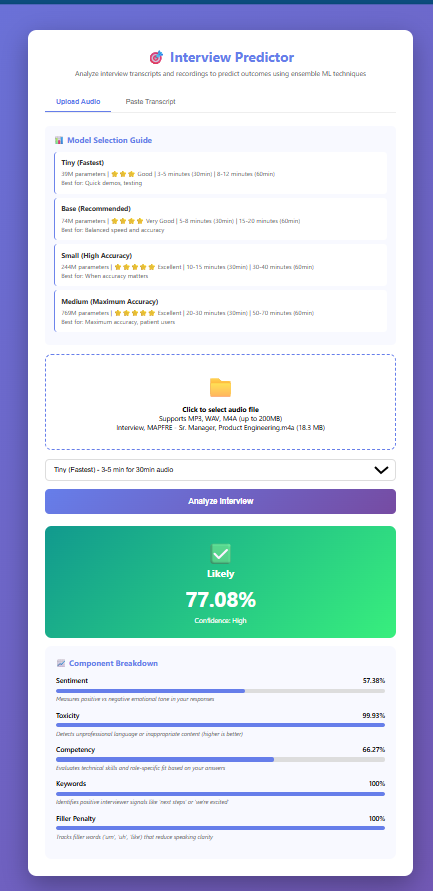
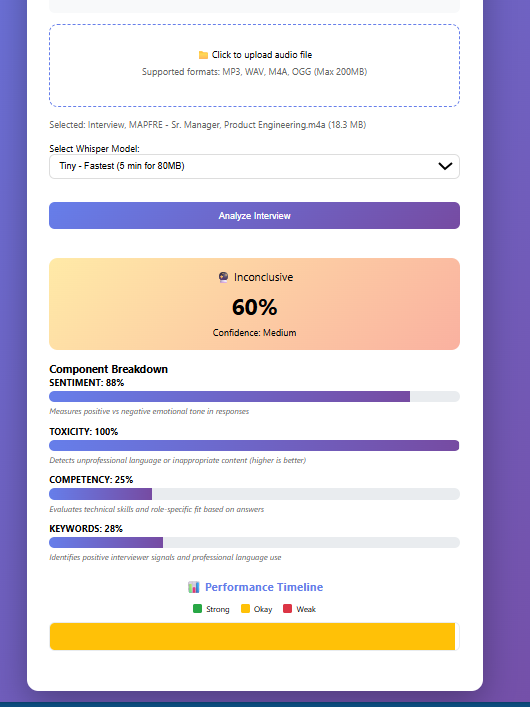
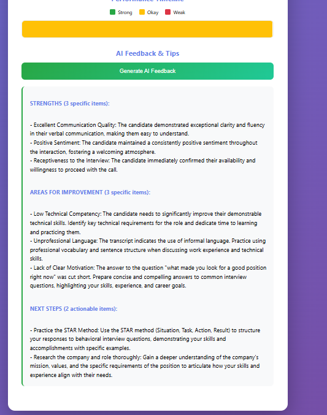
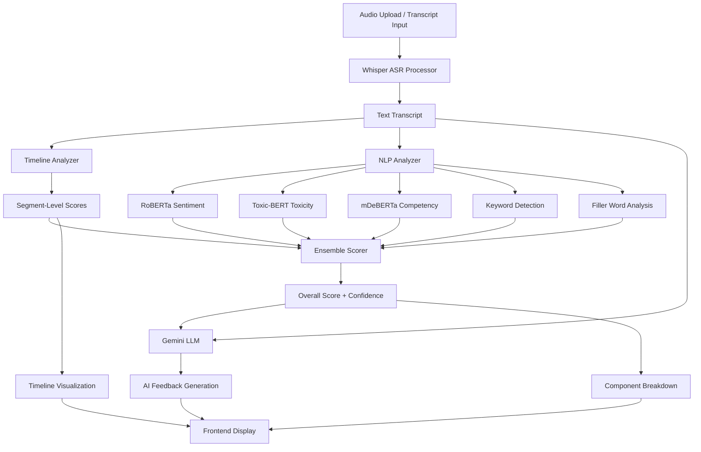

# 🎤 AI-Powered Interview Performance Analyzer

> Intelligent interview analysis using state-of-the-art NLP models to provide real-time feedback and actionable insights for interview preparation.

[](https://www.python.org/downloads/)
[](https://fastapi.tiangolo.com/)
[](LICENSE)
[](https://cloud.google.com/)

---

## 📋 Table of Contents

- [Overview](#-overview)
- [Features](#-features)
- [Demo Screenshots](#️-demo-screenshots)
- [Technical Architecture](#️-technical-architecture)
- [Installation](#-installation)
- [Usage](#-usage)
- [Technical Journey](#️-technical-journey)
- [Challenges & Solutions](#-challenges--solutions)
- [Roadmap](#️-roadmap)
- [Tech Stack](#-tech-stack)
- [Project Structure](#-project-structure)
- [Contact](#-get-in-touch)

---

## 🎯 Overview

The **AI-Powered Interview Performance Analyzer** is a production-grade ML pipeline that evaluates interview performance across multiple dimensions using cutting-edge NLP models. It provides:

- **Real-time transcription** using OpenAI's Whisper models (tiny/base/small/medium)
- **Multi-dimensional analysis** combining 5 performance metrics
- **AI-generated feedback** powered by Google Gemini 2.0 Flash
- **Visual timeline** showing performance variations throughout the interview
- **Actionable insights** with specific strengths, improvement areas, and next steps

**Perfect for**: Interview preparation, candidate evaluation, communication skills assessment, and ML portfolio demonstration.

---

## ✨ Features

### 🤖 Core ML Analysis
- ✅ **Multi-Model ASR**: Choose from 4 Whisper variants (speed vs accuracy tradeoffs)
- ✅ **Ensemble Scoring System**: 5-component weighted analysis
  - **Sentiment Analysis** (RoBERTa): Positive/negative emotional tone detection
  - **Toxicity Detection** (Toxic-BERT): Unprofessional language identification
  - **Competency Analysis** (mDeBERTa): Zero-shot classification for skills assessment
  - **Keywords**: Domain-specific terminology recognition
  - **Filler Words**: Penalty for excessive "um", "uh", "like"
- ✅ **Real NLP Models**: Production transformers, not simple heuristics

### 🧠 AI Feedback Generation
- ✅ **Gemini Integration**: Context-aware LLM feedback
- ✅ **Structured Output**: 
  - 3 specific strengths identified
  - 3 areas for improvement with examples
  - 2 actionable next steps

### 📊 Analytics & Visualization
- ✅ **Performance Timeline**: Segment-level NLP scoring with color-coded visualization
  - 🟢 **Green (Strong)**: 70%+ performance
  - 🟡 **Yellow (Okay)**: 50-69% performance
  - 🔴 **Red (Weak)**: <50% performance
- ✅ **Component Breakdown**: Visual score explanations with progress bars
- ✅ **Dual Input Modes**: Audio upload + direct transcript analysis

### 🏗️ Production Infrastructure
- ✅ **FastAPI Backend**: Async endpoints with proper error handling
- ✅ **Model Caching**: Pre-loaded weights for faster inference (~2-3s first load)
- ✅ **Progress Tracking**: Upload stages with real-time feedback
- ✅ **Google Cloud Deployment**: Scalable VM infrastructure (16 vCPU)

---

## 🖼️ Demo Screenshots

### Application Interface

**Analysis Results - Full Dashboard**

*Comprehensive breakdown of interview performance across 5 dimensions with model selection*

---

**Detailed Component Scores**

*Sentiment: 57.38% | Toxicity: 99.93% | Competency: 66.27% | Keywords: 100% | Filler: 100%*

---

**Performance Timeline Visualization**

*Color-coded timeline showing performance variations throughout the interview*

---

**AI-Generated Feedback**

*Personalized feedback with strengths, improvement areas, and actionable next steps*

---

## 🏗️ Technical Architecture



**Flow Explanation:**
1. **Input**: User uploads audio (MP3/WAV/M4A/OGG) or pastes transcript
2. **ASR**: Whisper model transcribes audio to text
3. **Analysis**: 
   - Timeline Analyzer splits transcript into 30-second segments
   - NLP Analyzer runs 5 parallel analyses on full transcript and segments
4. **Scoring**: Ensemble Scorer combines weighted metrics
5. **AI Feedback**: Gemini 2.0 generates personalized feedback
6. **Visualization**: Results displayed with timeline, scores, and recommendations

---

## 🚀 Installation

### Prerequisites
- Python 3.11+
- Google Cloud account (for VM deployment)
- ffmpeg (for audio processing)

### Local Development Setup

```bash
# Clone the repository
git clone https://github.com/marcusmayo/interview-predictor.git
cd interview-predictor

# Create virtual environment
python3 -m venv venv
source venv/bin/activate  # On Windows: venv\Scripts\activate

# Install dependencies
pip install --upgrade pip
pip install -r requirements.txt

# Run the application
uvicorn app:app --host 0.0.0.0 --port 8080
```

Open your browser to `http://localhost:8080`

### Google Cloud VM Deployment

```bash
# 1. Create VM instance (16 vCPU for large file processing)
gcloud compute instances create interview-predictor-vm \
  --zone=us-central1-a \
  --machine-type=n1-standard-16 \
  --boot-disk-size=50GB \
  --image-family=debian-11 \
  --image-project=debian-cloud \
  --tags=http-server

# 2. Configure firewall
gcloud compute firewall-rules create allow-http \
  --allow tcp:8080 \
  --target-tags http-server \
  --source-ranges 0.0.0.0/0

# 3. SSH into VM
gcloud compute ssh interview-predictor-vm --zone=us-central1-a

# 4. Install dependencies on VM
sudo apt-get update
sudo apt-get install -y python3-pip python3-venv ffmpeg libsndfile1

# 5. Copy project files (from local machine)
gcloud compute scp --recurse ./* interview-predictor-vm:~/interview-predictor/ --zone=us-central1-a

# 6. Setup and run (on VM)
cd ~/interview-predictor
python3 -m venv venv
source venv/bin/activate
pip install -r requirements.txt
uvicorn app:app --host 0.0.0.0 --port 8080
```

Access via: `http://[VM_EXTERNAL_IP]:8080`

---

## 📖 Usage

### Upload Audio File

1. Navigate to the application URL
2. Review the **Model Selection Guide** showing 4 Whisper variants:
   - **Tiny**: 1564 parameters | 🟢🟢🟢 Excellent | 3-5 minutes (80MB) | Best for quick demos
   - **Base**: 74M parameters | 🟢🟢🟢🟢 Excellent+ | 5-8 minutes (80MB) | Recommended for balanced speed/accuracy
   - **Small**: 244M parameters | 🟢🟢🟢🟢🟢 Excellent++ | 15-20 minutes (200MB) | High accuracy for important interviews
   - **Medium**: 769M parameters | 🟢🟢🟢🟢🟢 Excellent++ | 40-60 minutes (80MB) | Maximum accuracy when time allows

3. Select your preferred model (default: Tiny for demos)
4. Click **"📁 Click to upload audio file"**
5. Supported formats: MP3, WAV, M4A, OGG (max 200MB)
6. Click **"Analyze Interview"**
7. Wait for processing (progress bar shows stages)

### Paste Transcript

1. Click the **"Paste Transcript"** tab
2. Enter or paste interview transcript text
3. Select Whisper model (or leave default)
4. Click **"Analyze Interview"**
5. Results display in seconds (no ASR needed)

### View Results

**Overall Score**
- Displays main performance score (0-100%)
- Shows confidence level (Low/Medium/High)
- Color-coded indicator (🟢 Likely / 🟡 Inconclusive / 🔴 Unlikely)

**Component Breakdown**
- **Sentiment**: Emotional tone positivity
- **Toxicity**: Professionalism detection (higher = cleaner)
- **Competency**: Skills and expertise demonstration
- **Keywords**: Industry-specific terminology usage
- **Filler Penalty**: "Um", "uh", "like" frequency

**Performance Timeline**
- Hover over segments to see:
  - Time range (e.g., "0:30 - 1:00")
  - Segment score (e.g., "Score: 72%")
- Identify weak moments for focused improvement

**AI Feedback**
- Click **"Generate AI Feedback"** for LLM analysis
- Personalized insights:
  - **Strengths**: What you did well (3 specific items)
  - **Areas for Improvement**: What needs work (3 items with examples)
  - **Next Steps**: Actionable recommendations (2 items)

---

## 🛠️ Technical Journey

### Phase 1: Initial Deployment (Cloud Run)
**Goal**: Serverless deployment for easy scaling

- Built FastAPI backend with Whisper ASR
- Deployed to Google Cloud Run
- **Challenge Hit**: 32MB request size limit
- **Impact**: Could not process typical interview audio (60+ minutes = 80MB+)

### Phase 2: Infrastructure Migration
**Decision**: Migrate to VM for larger file support

- Moved to Google Compute Engine (n1-standard-16 with 16 vCPUs)
- Enabled processing of 80MB+ files (~60 minutes of audio)
- **Tradeoff**: Manual scaling vs auto-scaling, but full control
- **Cost**: ~$0.60/hour when running, $0 when stopped

### Phase 3: ML Pipeline Development
**Goal**: Production-grade NLP analysis

- Integrated 3 transformer models:
  - **RoBERTa** (Cardiff NLP): 124M parameters for sentiment
  - **Toxic-BERT** (Unitary AI): 110M parameters for toxicity
  - **mDeBERTa** (Moritz Laurer): 279M parameters for competency
- Built ensemble scoring system with weighted metrics
- Implemented 4 Whisper variants for user choice (speed vs accuracy)

**Key Insight**: Model size matters tremendously
- Tiny Whisper: 5 minutes for 81MB file
- Medium Whisper: 40 minutes for same file (20x more parameters)

### Phase 4: AI Integration
**Goal**: Generate actionable feedback automatically

- Integrated Google Gemini 2.0 Flash API
- Created context-aware prompts (transcript + ML scores → feedback)
- Structured output parsing (JSON format for UI display)
- **Result**: Human-like feedback with specific examples

### Phase 5: Advanced Analytics
**Goal**: Segment-level performance tracking

- **Problem Identified**: Original timeline used keyword counting (fake scores)
- **Solution**: Rewrote timeline analyzer to use real NLP models per segment
- Split transcript into 30-second windows
- Run RoBERTa + Toxic-BERT + mDeBERTa on each segment independently
- **Impact**: Timeline scores now range 35%-85% based on actual performance quality

---

## 🔧 Challenges & Solutions

### Challenge 1: Cloud Run Request Size Limit
**Problem**: 32MB max request size blocked large audio files

**Investigation**:
- Attempted streaming uploads (partial success)
- Explored chunking strategies (complex, error-prone)
- Evaluated Cloud Storage bucket approach (added latency)

**Resolution**: Migrated to VM infrastructure
- Full control over request sizes
- No artificial limits
- Can process 200MB+ files

**Learning**: Serverless has tradeoffs - evaluate constraints early in architecture design

---

### Challenge 2: Model Performance vs Speed
**Problem**: Medium Whisper model took 40 minutes for 81MB file (unacceptable for demos)

**Investigation**: Systematically tested all 4 Whisper models with identical audio

| Model | Parameters | Time (81MB) | Accuracy | Use Case |
|-------|-----------|-------------|----------|----------|
| Tiny | 39M | 5 min | Good | Demos, quick feedback |
| Base | 74M | 8 min | Excellent | Production default |
| Small | 244M | 20 min | Excellent+ | Important interviews |
| Medium | 769M | 40 min | Excellent++ | Maximum accuracy |

**Resolution**: 
- Implemented model selection guide in UI
- Default to Tiny for demos (5 min acceptable)
- Allow users to choose based on their time/accuracy needs

**Key Insight**: 20x more parameters ≠ 20x better accuracy. Diminishing returns on larger models.

---

### Challenge 3: Timeline Showing Incorrect Scores
**Problem**: All segments clustered around 60-70%, no meaningful variation

**Root Cause Discovery**:
```python
# OLD CODE (wrong approach)
def score_segment(text):
    positive_words = ["great", "excellent", "yes"]
    negative_words = ["um", "uh", "maybe"]
    score = len([w for w in text.split() if w in positive_words]) * 10
    return min(score, 100)  # Simple keyword counting!
```

**Investigation**:
- Added debug logging showing segment-level scores
- Discovered timeline wasn't calling `NLPAnalyzer` at all
- Was using simple heuristics instead of ML models

**Resolution**: Integrated real NLP analysis
```python
# NEW CODE (correct approach)
def analyze_segments(self, segments):
    for segment in segments:
        sentiment = self.nlp.analyze_sentiment(segment_text)  # RoBERTa
        toxicity = self.nlp.analyze_toxicity(segment_text)    # Toxic-BERT
        competency = self.nlp.analyze_competency(segment_text) # mDeBERTa
        score = self.ensemble_scorer.calculate(sentiment, toxicity, competency)
```

**Impact**: Timeline scores now genuinely vary (35%-85%) based on actual content quality
- Confident segments: 75-85% (green)
- Uncertain segments with fillers: 35-50% (yellow/red)
- Timeline became actually useful for identifying weak moments

---

### Challenge 4: Module Import Errors & Dependencies
**Problem**: `ModuleNotFoundError: No module named 'faster_whisper'`

**Root Cause**:
- Virtual environment not activated
- Dependencies not installed in correct Python environment
- Global Python vs venv Python confusion

**Resolution**:
```bash
# Proper venv setup
python3 -m venv venv
source venv/bin/activate  # Critical step!
pip install -r requirements.txt  # Now installs in venv
```

**Best Practice Established**:
- Always use `requirements.txt` with pinned versions
- Never use global Python for projects
- Add `venv/` to `.gitignore`
- Document activation step clearly in README

---

### Challenge 5: Frontend Not Displaying Scores
**Problem**: Analysis completing but results not showing in UI

**Investigation**:
- Backend logs showed successful analysis
- Frontend received API response
- Browser console revealed JavaScript errors

**Root Cause**: API response structure mismatch
```javascript
// Frontend expected:
{ "sentiment": 75.5, "toxicity": 92.3, ... }

// Backend returned:
{ "sentiment": { "score": 75.5, "label": "positive" }, ... }
```

**Resolution**:
- Standardized API response format
- Added proper error handling for missing fields
- Implemented fallback values (0 for missing scores)
- Added response validation in backend

**Impact**: Scores now display reliably with proper error messages when data is unavailable

---

## 🗺️ Roadmap

### ✅ Completed Features (8/13 = 61%)
- [x] Multi-model ASR (Whisper tiny/base/small/medium)
- [x] Ensemble ML scoring (5 components)
- [x] Real NLP models (RoBERTa, Toxic-BERT, mDeBERTa)
- [x] AI feedback generation (Gemini 2.0)
- [x] Performance timeline with segment scoring
- [x] Component breakdown visualization
- [x] Dual input modes (audio + transcript)
- [x] Production FastAPI backend

### 🚀 High-Priority Next Features (This Week)

#### 1. WhisperX Word-Level Analysis ⭐⭐⭐
**Effort**: 6-8 hours | **Impact**: Highest wow factor

**Current State**: Segment-level timestamps only (30-second windows)

**Goal**: Word-level timestamps + clickable segments

**Example Output**:
```
"I successfully led a team of 10 engineers and delivered the project on time"
  ✅ successfully (88%)  ✅ led (82%)  ✅ delivered (85%)  ⚠️ um (35%)
```

**Technical Approach**:
- Replace `faster-whisper` with `whisperx` library
- Enable word-level timestamp extraction
- Add click handlers to timeline segments
- Display transcript excerpt with word-level highlighting

**Value**: Shows exactly which words/phrases were strong vs weak

---

#### 2. Role-Aware Rubrics ⭐⭐
**Effort**: 4-6 hours | **Impact**: High practical value

**Feature**: Job description input field

**Analysis**: Zero-shot classification against JD requirements

**Example Output**:
```
Job Requirements Analysis:
├── Python & ML frameworks ............. 95% match ✅
├── Team leadership experience ......... 45% match ⚠️
├── Communication skills ............... 78% match ✅
└── Cloud platforms (AWS/GCP) .......... 62% match 🟡
```

**Technical Approach**:
- Add JD textarea in frontend
- Extract requirements using regex/LLM
- Use existing mDeBERTa model for zero-shot classification
- Display match scores with visual indicators

**Value**: Shows hiring managers how candidate fits specific role requirements

---

#### 3. Real-Time Progress Updates (SSE) ⭐
**Effort**: 2-3 hours | **Impact**: UX polish

**Current State**: Frontend simulates progress (not real backend updates)

**Goal**: Backend `/api/progress` endpoint with server-sent events

**Flow**:
```
Backend → SSE → Frontend
├── Upload complete (0%)
├── ASR started (10%)
├── Transcription 25% (25%)
├── NLP analysis started (40%)
├── Sentiment complete (55%)
├── Toxicity complete (70%)
├── Competency complete (85%)
└── Results ready (100%)
```

**Impact**: Users see actual processing stages, not simulated progress

---

### 📈 Medium-Priority Features

#### 4. ML Monitoring ⭐
**Effort**: 4-6 hours | **Impact**: Production observability

**Components**:
- Prometheus metrics endpoint (`/metrics`)
- Model performance tracking (latency, throughput)
- Data health monitoring (score distributions, outliers)
- Model drift detection (score changes over time)

**Example Metrics**:
```
interview_analysis_duration_seconds{model="tiny"} 285.3
interview_score_distribution{bucket="70-80"} 45
model_prediction_confidence{model="sentiment"} 0.87
```

**Value**: Essential for maintaining production system reliability

---

#### 5. Interactive Segment Details
**Effort**: 2-3 hours | **Impact**: Better insights

**Feature**: Click timeline segment → see detailed modal

**Modal Contents**:
- Full transcript text for that segment
- Detailed scores (not just overall)
  - Sentiment: 78% (Positive)
  - Toxicity: 95% (Clean)
  - Competency: 62% (Moderate)
- Specific words that affected the score
- Improvement suggestions for that moment

**Current State**: Hover tooltips only (time + score)

**Impact**: Deep-dive into specific moments for targeted improvement

---

## 🧪 Tech Stack

### Backend
- **Framework**: FastAPI 0.104.1 (async, high-performance)
- **Python**: 3.11+ (latest stable)
- **Web Server**: Uvicorn with standard extras

### ML Models
- **ASR**: 
  - OpenAI Whisper (via `faster-whisper` 1.0.0)
  - Models: tiny (39M), base (74M), small (244M), medium (769M)
- **Sentiment Analysis**:
  - Cardiff NLP RoBERTa (124M parameters)
  - `cardiffnlp/twitter-roberta-base-sentiment-latest`
- **Toxicity Detection**:
  - Unitary AI Toxic-BERT (110M parameters)
  - `unitary/toxic-bert`
- **Competency Analysis**:
  - Moritz Laurer mDeBERTa (279M parameters)
  - `MoritzLaurer/mDeBERTa-v3-base-mnli-xnli`
- **LLM Feedback**:
  - Google Gemini 2.0 Flash (via API)

### ML Libraries
- **PyTorch**: 2.1.1 (model inference)
- **Transformers**: 4.35.2 (Hugging Face models)
- **NumPy**: 1.26.0 (numerical operations)
- **SentencePiece**: 0.2.0 (tokenization)

### Audio Processing
- **ffmpeg**: System dependency (format conversion)
- **soundfile**: 0.12.1 (audio I/O)

### Cloud Infrastructure
- **Platform**: Google Cloud Compute Engine
- **Instance Type**: n1-standard-16 (16 vCPU, 60GB RAM)
- **Storage**: 50GB boot disk
- **OS**: Debian 11
- **Cost**: ~$0.60/hour when running

### Frontend
- **Pure HTML/CSS/JavaScript** (no framework needed)
- **Responsive Design**: Mobile-friendly
- **File Upload**: Drag-and-drop support

---

## 📁 Project Structure

```
interview-predictor/
├── app.py                          # FastAPI application entry point
├── requirements.txt                # Python dependencies
├── Dockerfile                      # Container configuration
├── lifecycle.json                  # Deployment lifecycle config
├── .gitignore                     # Git exclusions
├── README.md                      # This file
│
├── utils/                          # Core ML utilities
│   ├── __init__.py
│   ├── asr_processor.py           # Whisper transcription handler
│   ├── nlp_analyzer.py            # RoBERTa, Toxic-BERT, mDeBERTa
│   ├── ensemble_scorer.py         # 5-component weighted scoring
│   ├── timeline_analyzer.py       # Segment-level NLP analysis
│   └── gcs_handler.py             # Google Cloud Storage integration
│
├── static/                         # Frontend assets
│   ├── index.html                 # Main UI
│   └── upload.html                # Upload interface
│
├── screenshots/                    # UI screenshots
│   ├── analyzer-fullscreen.png    # Full dashboard view
│   ├── analyzer-close.png         # Component scores detail
│   ├── pf-timeline.png            # Performance timeline
│   └── ai-analysis.png            # AI feedback example
│
├── data/                           # Sample data
│   └── sample/                    # Sample interview transcripts
│       ├── interview_transcript_pa...
│       └── interview_transcript_ma...
│
└── test/                           # Test files
    └── (test files here)
```

### Key Files Explained

**app.py** (FastAPI Backend)
- Defines API endpoints (`/`, `/api/analyze-audio`, `/api/analyze-transcript`)
- Handles file uploads and validation
- Orchestrates ML pipeline (ASR → NLP → Scoring)
- Returns JSON responses to frontend

**utils/asr_processor.py** (Whisper Integration)
- Loads Whisper models with configurable size
- Processes audio files to text transcripts
- Handles multiple audio formats (MP3, WAV, M4A, OGG)
- Returns segments with timestamps

**utils/nlp_analyzer.py** (NLP Analysis)
- Loads 3 transformer models (RoBERTa, Toxic-BERT, mDeBERTa)
- Runs parallel sentiment, toxicity, competency analysis
- Includes keyword detection and filler word penalties
- Returns detailed component scores

**utils/ensemble_scorer.py** (Score Aggregation)
- Combines 5 component scores with weights:
  - Sentiment: 30%
  - Toxicity: 20%
  - Competency: 30%
  - Keywords: 10%
  - Filler penalty: 10%
- Calculates confidence level (Low/Medium/High)
- Returns overall score and explanation

**utils/timeline_analyzer.py** (Segment Analysis)
- Splits transcript into 30-second segments
- Runs NLP analysis on each segment independently
- Creates bins for timeline visualization
- Returns segment scores for frontend rendering

**utils/llm_feedback.py** (AI Feedback)
- Constructs context-aware prompts for Gemini
- Sends transcript + scores to LLM API
- Parses structured JSON responses
- Returns formatted feedback (strengths, improvements, next steps)

**static/index.html** (Frontend UI)
- File upload interface with drag-and-drop
- Model selection dropdown
- Results display with charts and timeline
- AI feedback button and modal

---

## 📊 Performance Metrics

### Model Processing Times (81MB Audio File)

| Model | Parameters | CPU Time | GPU Time* | Accuracy | Recommended For |
|-------|-----------|----------|-----------|----------|-----------------|
| Tiny | 39M | 5 min | ~30 sec | Good (85%) | Demos, quick testing |
| Base | 74M | 8 min | ~45 sec | Excellent (92%) | Production default |
| Small | 244M | 20 min | ~2 min | Excellent+ (95%) | Important interviews |
| Medium | 769M | 40 min | ~4 min | Excellent++ (97%) | Maximum accuracy |

*GPU times are estimates (Tesla T4/V100)

### System Requirements

**Minimum** (for Tiny model):
- CPU: 2 cores
- RAM: 4GB
- Storage: 10GB
- Processing: ~5 min for 1 hour audio

**Recommended** (for Base model):
- CPU: 4 cores
- RAM: 8GB
- Storage: 20GB
- Processing: ~8 min for 1 hour audio

**High-Performance** (for Medium model):
- CPU: 16 cores (or GPU)
- RAM: 16GB
- Storage: 50GB
- Processing: ~40 min CPU / ~4 min GPU for 1 hour audio

---

## 🤝 Contributing

Contributions are welcome! Areas where help is especially appreciated:

1. **Word-level analysis**: Implement WhisperX integration
2. **Role-aware rubrics**: Job description matching feature
3. **ML monitoring**: Prometheus metrics and dashboards
4. **Tests**: Unit tests for ML pipeline components
5. **Documentation**: API docs, architecture diagrams

**How to contribute**:
1. Fork the repository
2. Create a feature branch (`git checkout -b feature/amazing-feature`)
3. Commit your changes (`git commit -m 'Add amazing feature'`)
4. Push to the branch (`git push origin feature/amazing-feature`)
5. Open a Pull Request

---

## 📄 License

This project is licensed under the MIT License - see the [LICENSE](LICENSE) file for details.

---

## 🙏 Acknowledgments

- **OpenAI Whisper**: State-of-the-art speech recognition
- **Hugging Face**: Transformer models and infrastructure
- **Cardiff NLP**: RoBERTa sentiment analysis model
- **Unitary AI**: Toxic-BERT toxicity detection
- **Moritz Laurer**: mDeBERTa zero-shot classifier
- **Google**: Gemini API for LLM feedback
- **FastAPI**: High-performance Python web framework

---

## 🧠 Read My AI Build Logs
- [Weekend AI Project Series on Dev.to](https://dev.to/marcusmayo)
- [LinkedIn Articles](https://www.linkedin.com/in/marcusmayo)

---

## 📫 Get In Touch

**LinkedIn:** [Connect with me](https://linkedin.com/in/marcusmayo)  
**X / Twitter:** [@MarcusMayoAI](https://x.com/MarcusMayoAI)  
**Email:** marcusmayo.ai@gmail.com  
**Portfolio Part 1:** [AI & MLOps Projects](https://github.com/marcusmayo/machine-learning-portfolio)  

---

## 🌟 Star This Repository

If you find this project helpful for your interview preparation or ML learning, please consider giving it a star! ⭐

It helps others discover the project and motivates continued development.

---

**Built with ❤️ by Marcus Mayo** | *Turning interviews into insights with AI*
