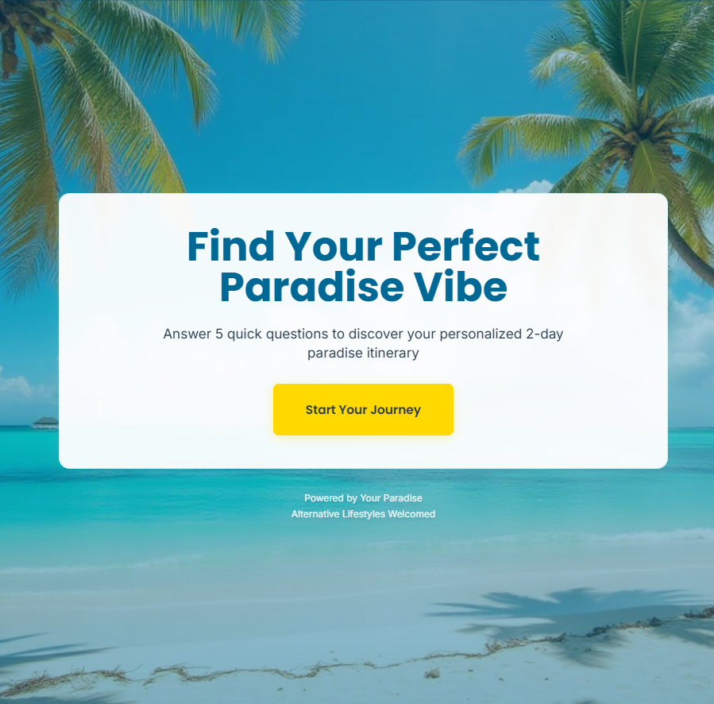
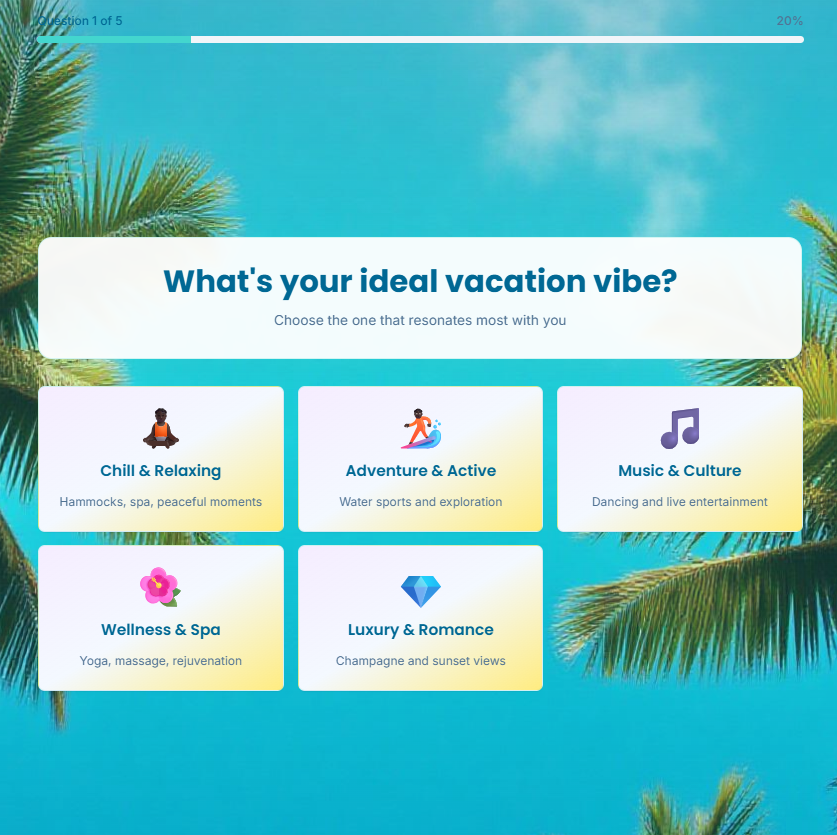
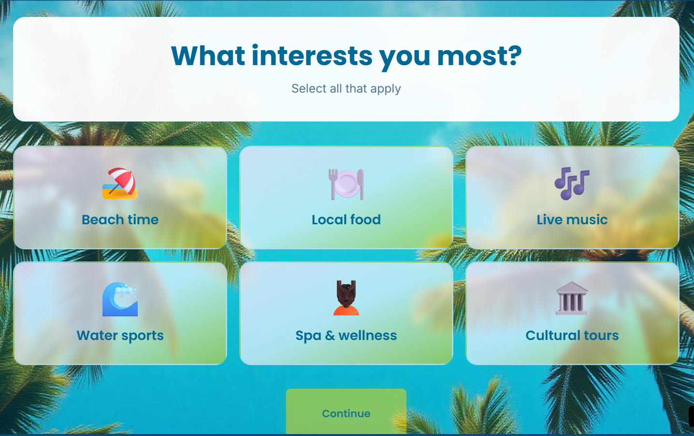
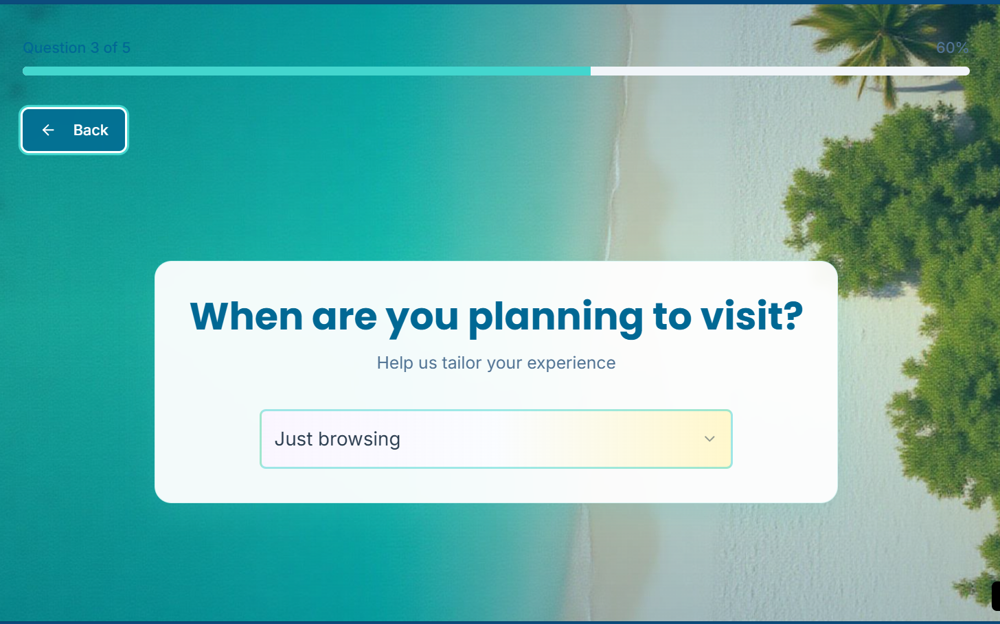
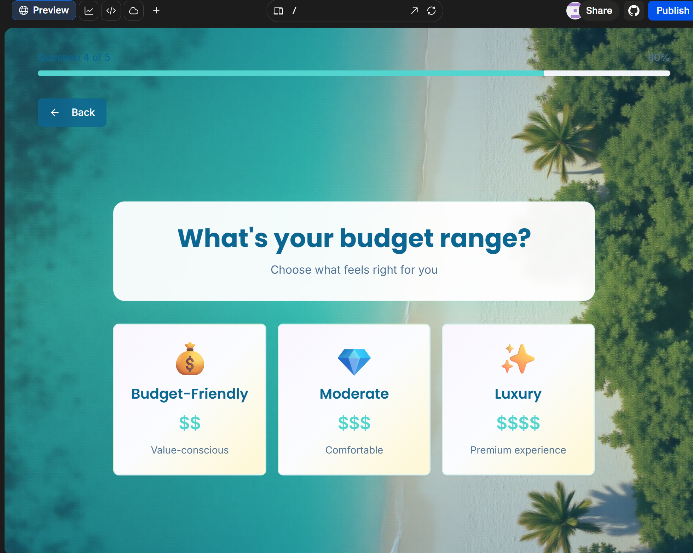
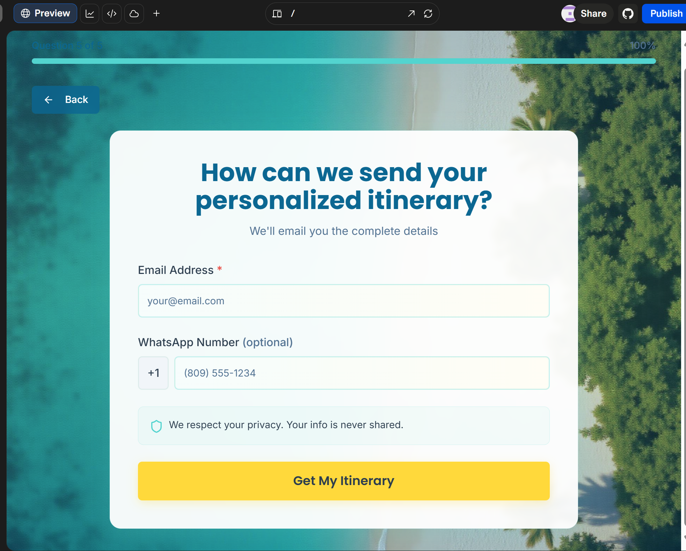
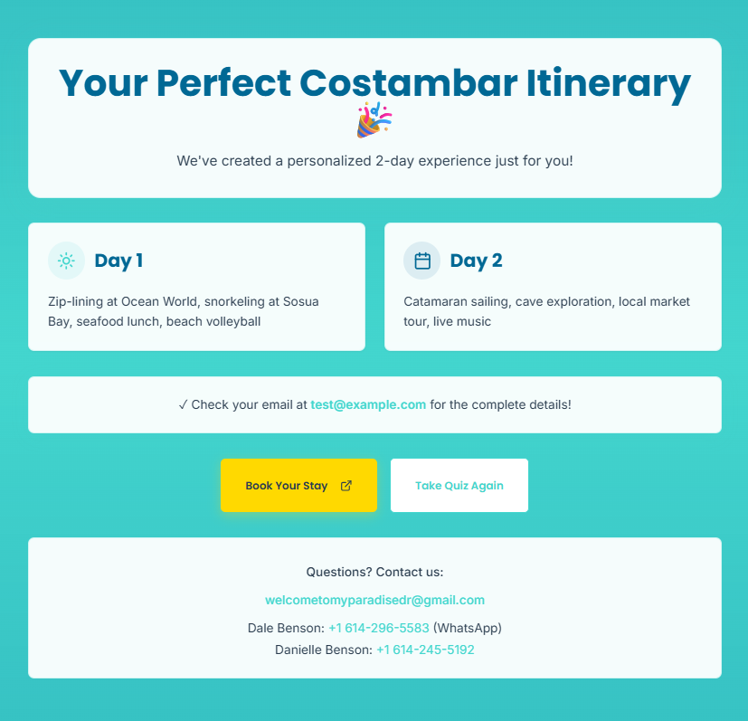

# 🌴 Paradise Groups Funnel

**Turn Facebook Group Members Into Hotel Bookings—At Zero Cost**

A production-ready, serverless lead-generation system that captures qualified leads from Facebook travel communities through a personalized quiz experience, then converts them to direct bookings for Your Paradise boutique hotel in Costambar, Dominican Republic.

[](https://paradise-vibe-finder.lovable.app/)
[](https://paradise-funnel-357972662917.us-east1.run.app/health)
[](#cost-breakdown)

---

## 📱 Try It Now!

<div align="center">

### Scan to Experience the Quiz


**Or visit:** [paradise-vibe-finder.lovable.app](https://paradise-vibe-finder.lovable.app/)

</div>

---

## 🎯 The Problem

Small boutique hotels lose **15-25% of revenue** to OTA commissions (Booking.com, Expedia). Facebook Groups have **highly engaged travel communities**, but no easy way to capture and qualify leads without expensive ads.

## 💡 The Solution

A **free, organic funnel** that:
1. **Engages** travelers in Facebook Groups with a 60-second personality quiz
2. **Captures** leads with personalized 2-day itineraries
3. **Converts** to direct bookings via email follow-up and a clear CTA
4. **Tracks** ROI per group with UTM parameters
5. **Costs $0/month** on cloud free tiers

---

## 🎨 Visual Walkthrough

### Landing Page


Clean, inviting design with tropical beach background and clear value proposition.

---

### Question 1: Choose Your Vibe


Users select from 5 personality-driven vacation styles:
- 🧘 **Chill & Relaxing** - Hammocks, spa, peaceful moments
- 🏄 **Adventure & Active** - Water sports and exploration
- 🎵 **Music & Culture** - Dancing and live entertainment
- 🌺 **Wellness & Spa** - Yoga, massage, rejuvenation
- 💎 **Luxury & Romance** - Champagne and sunset views

---

### Question 2: Select Your Interests


Multi-select to capture specific preferences:
- 🏖️ Beach time
- 🍽️ Local food
- 🎶 Live music
- 🌊 Water sports
- 💆 Spa & wellness
- 🏛️ Cultural tours

---

### Question 3: Travel Timeline


Dropdown with months plus "Just browsing" option for early-stage browsers.

---

### Question 4: Budget Range


Three friendly budget tiers:
- 💰 **Budget-Friendly** ($) - Value-conscious
- 💎 **Moderate** ($$) - Comfortable
- ✨ **Luxury** ($$) - Premium experience

---

### Question 5: Contact Info


Email required, WhatsApp optional. Clear privacy message builds trust.

---

### Results: Personalized Itinerary


Instant gratification with:
- ✅ 2-day custom itinerary
- 📧 Email notification promise
- 🟡 **"Book Your Stay"** CTA (golden button)
- 🔄 Option to retake quiz
- 📞 Contact information (email + WhatsApp)

---

## 🚀 Live Demo

**Try it yourself:**
- **Quiz:** https://paradise-vibe-finder.lovable.app/
- **API Docs:** https://paradise-funnel-357972662917.us-east1.run.app/docs
- **Main Website:** https://welcometoyourdominicanparadise.com

**Test the API:**
```bash
curl -X POST "https://paradise-funnel-357972662917.us-east1.run.app/api/quiz" \
  -H "Content-Type: application/json" \
  -d '{
    "email": "traveler@example.com",
    "vibe": "chill",
    "interests": ["beach", "food"],
    "budget": "moderate",
    "utm_source": "fb_group",
    "utm_campaign": "test"
  }'
```

---

## 🏗️ Architecture

```
┌─────────────────┐
│ Facebook Group  │
│   (Organic)     │
└────────┬────────┘
         │
         ▼
┌─────────────────────────────────┐
│  Quiz Frontend (Lovable)        │
│  https://paradise-vibe-finder   │
│  - React + TypeScript           │
│  - Tailwind CSS                 │
│  - Mobile-responsive            │
└────────┬────────────────────────┘
         │ HTTP POST
         ▼
┌─────────────────────────────────┐
│  API Backend (Cloud Run)        │
│  https://paradise-funnel-...    │
│  - Python 3.11 + FastAPI        │
│  - Pydantic validation          │
│  - Auto-scaling 0→10            │
└────────┬────────────────────────┘
         │
         ▼
┌─────────────────────────────────┐
│  Database (Firestore)           │
│  - NoSQL document store         │
│  - Real-time sync               │
│  - Free tier: 1GB + 50K reads   │
└────────┬────────────────────────┘
         │
         ▼
┌─────────────────────────────────┐
│  Email Service (Mailjet)        │
│  - Automated itineraries        │
│  - Free tier: 200/day           │
│  - Status: Pending approval     │
└─────────────────────────────────┘
         │
         ▼
┌─────────────────────────────────┐
│  Booking Site                   │
│  welcometoyourdominicanparadise │
└─────────────────────────────────┘
```

---

## ✨ Features

| Feature | Status | Description |
|---------|--------|-------------|
| **Personalized Quiz** | ✅ Live | 5 questions matching travelers to "vibes" (Chill/Adventure/Music/Wellness/Luxury) |
| **Dynamic Itineraries** | ✅ Live | 2-day plans generated based on preferences + budget |
| **Lead Capture** | ✅ Live | Email + optional WhatsApp saved to Firestore |
| **UTM Tracking** | ✅ Live | Track ROI per Facebook group with campaign parameters |
| **Mobile-Responsive** | ✅ Live | Beautiful UI on phones, tablets, desktops |
| **Direct Booking CTA** | ✅ Live | "Book Your Stay" button links to main website |
| **Email Automation** | ⏳ Pending | Awaiting Mailjet business verification (Ticket #3748068) |
| **Group-Specific Offers** | 🔄 Ready | Infrastructure for unique promo codes per group |
| **A/B Testing** | 🔄 Ready | Architecture supports multiple quiz versions |

---

## 🛠️ Tech Stack

### Frontend
- **Framework:** React 18 + TypeScript
- **Styling:** Tailwind CSS
- **Hosting:** Lovable (Netlify-based CDN)
- **Build:** Vite
- **Cost:** $0

### Backend
- **Language:** Python 3.11
- **Framework:** FastAPI 0.104.1
- **Validation:** Pydantic 2.5.0
- **Hosting:** Google Cloud Run
- **Container:** Docker
- **Cost:** $0 (2M requests/month free)

### Database
- **Type:** Google Firestore (NoSQL)
- **Schema:** Document-based, JSON-like
- **Free Tier:** 1GB storage, 50K reads/day, 20K writes/day
- **Cost:** $0

### Email
- **Provider:** Mailjet
- **Free Tier:** 200 emails/day
- **Status:** Pending business verification
- **Fallback:** Manual WhatsApp follow-up
- **Cost:** $0

### DevOps
- **Version Control:** GitHub
- **CI/CD:** GitHub Actions (ready)
- **Monitoring:** Cloud Run metrics + Firestore console
- **Secrets:** Cloud Run environment variables

---

## 📊 Performance Metrics

| Metric | Target | Current |
|--------|--------|---------|
| Quiz Completion Rate | >60% | Tracking starts at launch |
| API Latency (p95) | <500ms | <200ms ✅ |
| Lead Capture Rate | 100% of completions | 100% ✅ |
| Email Open Rate | >30% | Pending approval |
| Booking Conversion | 15-25% | TBD after launch |

---

## 💰 Cost Breakdown

**Total Monthly Cost: $0.00**

| Service | Usage | Free Tier | Cost |
|---------|-------|-----------|------|
| **Lovable Hosting** | Frontend CDN | Unlimited | $0 |
| **Cloud Run** | Serverless API | 2M requests/month | $0 |
| **Firestore** | NoSQL database | 1GB + 50K reads/day | $0 |
| **Container Registry** | Docker image storage | 0.5GB | $0 |
| **Mailjet** | Email delivery | 200 emails/day | $0 |

**Cost at scale (1,000 leads/month):** Still $0

**When you'll start paying:**
- Cloud Run: After 2M requests/month ($0.40/million thereafter)
- Firestore: After 1GB storage or 50K reads/day
- Mailjet: After 200 emails/day (upgrade to $15/month for 15K/month)

---

## 🚀 Quick Start

### Prerequisites
- Python 3.11+
- Docker
- Google Cloud account (free tier)
- GitHub account

### Run Locally

```bash
# Clone the repo
git clone https://github.com/marcusmayo/ai-ml-portfolio-2.git
cd ai-ml-portfolio-2/paradise-groups-funnel

# Create virtual environment
python -m venv venv
source venv/bin/activate  # Windows: venv\Scripts\activate

# Install dependencies
pip install -r requirements.txt

# Copy environment template
cp .env.example .env
# Edit .env with your credentials

# Run the API
cd src
uvicorn app.api:app --reload --port 8080

# Test
curl http://localhost:8080/health
```

### Deploy to Cloud Run

```bash
# Build Docker image
docker build -t paradise-funnel:latest -f infra/Dockerfile .

# Tag for Google Container Registry
docker tag paradise-funnel:latest gcr.io/YOUR_PROJECT/paradise-funnel:latest

# Push to GCR
docker push gcr.io/YOUR_PROJECT/paradise-funnel:latest

# Deploy to Cloud Run
gcloud run deploy paradise-funnel \
  --image gcr.io/YOUR_PROJECT/paradise-funnel:latest \
  --region us-east1 \
  --allow-unauthenticated \
  --memory 512Mi \
  --min-instances 0 \
  --max-instances 10
```

---

## 📁 Project Structure

```
paradise-groups-funnel/
├── src/
│   ├── app/
│   │   └── api.py                 # FastAPI backend
│   ├── models/
│   │   └── schemas.py             # Pydantic data models
│   ├── utils/
│   │   ├── firestore_client.py    # Database operations
│   │   └── email_service.py       # Mailjet integration
│   ├── features/
│   │   └── itinerary.py           # Vibe-to-itinerary mapping
│   └── data/
│       └── places.json            # Local POI data
├── infra/
│   ├── Dockerfile                 # Production container
│   ├── docker-compose.yaml        # Local development
│   └── github/
│       └── workflows/
│           └── ci.yml             # CI/CD pipeline (ready)
├── tests/
│   ├── test_api.py               # API unit tests
│   └── test_schemas.py           # Schema validation tests
├── docs/
│   ├── DEPLOYMENT_NOTES.md       # Current status
│   └── PROJECT_PLAN.md           # Original plan
├── screenshots/
│   ├── 01-landing.png            # Quiz screenshots
│   ├── 02-vibe-question.png
│   ├── 03-interests.png
│   ├── 04-timeline.png
│   ├── 05-budget.png
│   ├── 06-contact.png
│   ├── 07-results.png
│   └── qr-code.png
├── notebooks/
│   └── exploration.ipynb         # Data exploration
├── deploy.sh                     # Quick deployment script
├── requirements.txt              # Python dependencies
├── .env.example                  # Environment template
├── .gitignore
└── README.md                     # This file
```

---

## 🔑 API Reference

### POST /api/quiz

Submit quiz results and capture lead.

**Request Body:**
```json
{
  "email": "traveler@example.com",
  "whatsapp": "+18095551234",
  "vibe": "chill",
  "travel_month": "March",
  "interests": ["beach", "food"],
  "budget": "moderate",
  "utm_source": "fb_group",
  "utm_medium": "organic",
  "utm_campaign": "black_travel_lovers"
}
```

**Response:**
```json
{
  "success": true,
  "message": "Thanks! Check your email for your custom itinerary.",
  "lead_id": "abc123xyz",
  "itinerary_preview": {
    "day_1": "Morning beach walk, lunch at beachside café...",
    "day_2": "Lazy breakfast, spa treatment, pool lounging..."
  }
}
```

### GET /health

Check API status.

**Response:**
```json
{
  "status": "healthy",
  "timestamp": "2025-10-11T14:30:00Z",
  "environment": "production",
  "email_configured": true
}
```

### GET /api/leads/{lead_id}

Retrieve a specific lead (admin only in production).

---

## 📈 Data Models

### QuizSubmission
```python
{
  "email": EmailStr,              # Required, validated
  "whatsapp": Optional[str],      # Optional, E.164 format
  "vibe": Literal["chill", "adventure", "music", "wellness", "luxe"],
  "travel_month": Optional[str],  # e.g. "March"
  "interests": List[str],         # ["beach", "food", "music"]
  "budget": Literal["budget", "moderate", "luxury"],
  "utm_source": Optional[str],    # e.g. "fb_group"
  "utm_medium": Optional[str],    # e.g. "organic"
  "utm_campaign": Optional[str]   # e.g. "group_name"
}
```

### Firestore Lead Document
```python
{
  "id": "auto_generated_id",
  "email": "traveler@example.com",
  "whatsapp": "+18095551234",
  "vibe": "chill",
  "travel_month": "March",
  "interests": ["beach", "food"],
  "budget": "moderate",
  "utm_source": "fb_group",
  "utm_campaign": "black_travel_lovers",
  "created_at": "2025-10-11T14:30:00Z",
  "updated_at": "2025-10-11T14:30:00Z",
  "status": "new"  # new | contacted | booked
}
```

---

## 🎨 Brand Identity

**Target Audience:**
- Black/African-American couples and singles
- Ages 25-55
- International travelers
- Seeking romance-friendly getaways
- Value consent-first spaces
- Active in Facebook travel groups

**Brand Colors:**
- Primary: `#4ECDC4` (Turquoise)
- Secondary: `#006994` (Ocean Blue)
- Accent: `#FFD700` (Gold)
- Background: `#F0F8FF` (Alice Blue)

**Tone:**
- Warm and aspirational
- Professional but approachable
- Inclusive and welcoming
- "Paradise is just a few clicks away!"

---

## 📧 Email Templates

Currently using **Mailjet** with beautiful HTML emails:

**Subject Lines (vibe-specific):**
- Chill: "Your Chill Paradise Awaits in Costambar 🧘"
- Adventure: "Your Adventure Itinerary is Ready! 🏄"
- Music: "Get Ready to Dance in Costambar! 🎵"
- Wellness: "Your Wellness Retreat Awaits 🌺"
- Luxury: "Your Luxury Escape to Paradise 💎"

**Content:**
- Personalized greeting
- 2-day itinerary (Day 1 & Day 2)
- "Book Your Stay" CTA button
- Contact information (email + WhatsApp)
- Brand tagline

---

## 🔒 Security & Privacy

- **No API keys in code**: Environment variables only
- **HTTPS everywhere**: TLS/SSL on all endpoints
- **CORS configured**: Allows frontend origin only
- **Input validation**: Pydantic schemas prevent injection
- **PII handling**: Emails stored in Firestore with proper permissions
- **Secret management**: Cloud Run environment variables
- **No spam**: Email opt-in only, clear unsubscribe

---

## 🚦 Current Status (October 11, 2025)

### ✅ Production Ready
- Frontend quiz deployed and live
- Backend API running on Cloud Run
- Firestore database capturing leads
- All 5 quiz questions functional
- UTM tracking implemented
- API endpoints tested and working
- Mobile-responsive design
- Direct booking CTA

### ⏳ Pending
- **Email automation**: Awaiting Mailjet business verification (Ticket #3748068)
- Expected approval: 1-2 business days
- Manual WhatsApp follow-up in the meantime

### 🔄 Next Up
- A/B testing framework
- Group-specific promo codes
- Admin dashboard (Streamlit)
- WhatsApp API integration
- Multi-language support (Spanish)

**Overall Completion: 90%**

---

## 📊 Business Model

**Customer Acquisition:**
1. Post quiz link in Facebook travel groups (free)
2. Group admins may pin or share (earned media)
3. Members take quiz, get value (personalized itinerary)
4. No paid ads required

**Lead Qualification:**
- Quiz filters by vibe, interests, budget, travel dates
- Only serious travelers complete full quiz
- Email capture = permission to follow up
- WhatsApp = higher intent

**Conversion Path:**
1. Email with full itinerary + booking link
2. Follow-up sequence (automated when emails live)
3. WhatsApp for high-intent leads
4. Direct booking = no OTA commission

**Target Metrics:**
- Quiz completion rate: >60%
- Email open rate: >30%
- Click-through rate: >15%
- Booking conversion: 15-25%
- Cost per lead: ~$0 (organic)

---

## 🎯 Target Facebook Groups

**Ideal Groups:**
- Black travel communities (e.g., "Black Travel Movement", "Black Jetsetters")
- Caribbean travel groups
- Puerto Plata/DR groups
- Romance travel groups
- Wellness travel communities
- Music/culture travel groups

**Posting Strategy:**
- Weekly "Vibe" post (image + story + quiz link)
- Value-first content (3 local tips, day trip ideas)
- Group-only perks (e.g., "Sunset welcome drink")
- Respect group rules (post on allowed days)

---

## 🧪 Testing

### Unit Tests
```bash
# Run all tests
pytest tests/ -v

# Run specific test
pytest tests/test_api.py::test_quiz_submission -v

# With coverage
pytest tests/ --cov=src --cov-report=html
```

### Integration Tests
```bash
# Test API endpoints
curl -X POST "http://localhost:8080/api/quiz" \
  -H "Content-Type: application/json" \
  -d @tests/fixtures/valid_quiz.json

# Test health check
curl http://localhost:8080/health
```

### Load Testing
```bash
# Simple load test (requires Apache Bench)
ab -n 1000 -c 10 http://localhost:8080/health
```

---

## 🐛 Troubleshooting

### API Not Responding
```bash
# Check Cloud Run logs
gcloud run services logs read paradise-funnel --region us-east1 --limit 50

# Check service status
gcloud run services describe paradise-funnel --region us-east1
```

### Emails Not Sending
- **Check Mailjet status**: https://app.mailjet.com/
- **Verify env vars**: `gcloud run services describe paradise-funnel`
- **Check logs for errors**: Look for `[EMAIL]` tags in logs

### Leads Not Saving
- **Verify Firestore permissions**: Check IAM roles
- **Check service account**: Cloud Run uses default service account
- **Review logs**: Look for Firestore connection errors

---

## 🚀 Deployment

### Production Checklist
- [ ] Environment variables set in Cloud Run
- [ ] Mailjet account verified
- [ ] Firestore indexes created (if using complex queries)
- [ ] Domain configured (if using custom domain)
- [ ] Monitoring alerts configured
- [ ] Backup strategy documented
- [ ] Rollback plan ready

### CI/CD (GitHub Actions)
```yaml
# .github/workflows/ci.yml (ready to use)
name: CI/CD
on: [push]
jobs:
  test:
    runs-on: ubuntu-latest
    steps:
      - uses: actions/checkout@v3
      - uses: actions/setup-python@v4
      - run: pip install -r requirements.txt
      - run: pytest tests/
  
  deploy:
    needs: test
    if: github.ref == 'refs/heads/main'
    runs-on: ubuntu-latest
    steps:
      - run: gcloud run deploy paradise-funnel ...
```

---

## 📈 Future Enhancements

### Short Term (1-2 weeks)
- [ ] Email automation (once Mailjet approved)
- [ ] WhatsApp API integration
- [ ] Group-specific landing pages
- [ ] Admin dashboard for lead management

### Medium Term (1-2 months)
- [ ] A/B testing framework
- [ ] Multi-language support (Spanish)
- [ ] Advanced analytics dashboard
- [ ] Automated email sequences

### Long Term (3-6 months)
- [ ] AI concierge chat (RAG-powered)
- [ ] Partner kit for micro-influencers
- [ ] Dynamic pricing integration
- [ ] Booking calendar integration

---

## 🤝 Contributing

This is a private project for Your Paradise, but contributions are welcome!

1. Fork the repo
2. Create a feature branch (`git checkout -b feature/amazing-feature`)
3. Commit changes (`git commit -m 'Add amazing feature'`)
4. Push to branch (`git push origin feature/amazing-feature`)
5. Open a Pull Request

---

## 📝 License

Private - All Rights Reserved

This project is proprietary software developed for Your Paradise boutique hotel.

---

## 📞 Contact Information

**Your Paradise**
- **Email:** welcometomyparadisedr@gmail.com
- **Dale Benson:** +1 614-296-5583 (WhatsApp)
- **Danielle Benson:** +1 614-245-5192
- **Website:** https://welcometoyourdominicanparadise.com

**Developer**
- **Marcus Mayo**
- **LinkedIn:** [Connect with me](https://linkedin.com/in/marcusmayo)
- **Email:** marcusmayo@hotmail.com
- **Portfolio Part 1:** [AI & MLOps Projects](https://github.com/marcusmayo/machine-learning-portfolio)
- **Dev.to Blog:** [Weekend AI Project Series](https://dev.to/marcusmayo)

---

## 🙏 Acknowledgments

- **Lovable** for the beautiful frontend builder
- **Google Cloud** for generous free tiers
- **Mailjet** for email infrastructure
- **FastAPI** for the excellent Python framework
- **Your Paradise** for the opportunity

---

## 📚 Additional Resources

- [FastAPI Documentation](https://fastapi.tiangolo.com/)
- [Firestore Documentation](https://firebase.google.com/docs/firestore)
- [Cloud Run Documentation](https://cloud.google.com/run/docs)
- [Mailjet API Docs](https://dev.mailjet.com/)
- [Lovable Documentation](https://docs.lovable.app/)

---

**Built with ❤️ for Your Paradise**

*Turning Facebook conversations into Caribbean getaways—one quiz at a time.* 🌴

---

### 🧠 Read My AI Build Logs
- [Weekend AI Project Series on Dev.to](https://dev.to/marcusmayo)
- [LinkedIn Articles](https://www.linkedin.com/in/marcusmayo)

---

*Last Updated: October 11, 2025*
